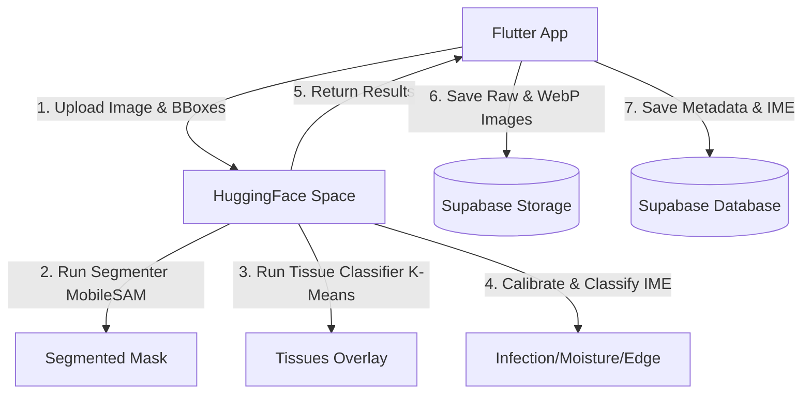

# Handover Guide: VerdaSense Wound Assessment Application

This project is an end-to-end clinical wound assessment system consisting of a Flutter mobile client, a Supabase database, and a HuggingFace Space machine learning inference backend.

## Project Architecture



---

## 1. Machine Learning Inference Backend (HuggingFace Space)
The model deployment directory is located at:
`C:\Users\Micole\MDS Research Project\WoundSegmenter`

*   **Repository URL:** Hosted on HuggingFace Space `Micole07/TIMENet`
*   **Segmenter Model:** MobileSAM (`mobile_sam.pt` and fine-tuned `mask_decoder.pth`).
*   **IME Classification Model:** Proposed Multi-Task Model (`SSL_IME_Round3_0.70_F1Moist.pth`).
*   **Calibration:** Temperature scaling parameters are applied in `ime_classifier.py` to prevent softmax overconfidence:
    *   Infection Temperature ($T_{\text{inf}}$) = `3.2051`
    *   Moisture Temperature ($T_{\text{moist}}$) = `2.6764`
    *   Edge Temperature ($T_{\text{edge}}$) = `1.8236`
*   **Timing logs:** Displays execution breakdowns for MobileSAM, K-Means, and IME in HuggingFace space logs.

---

## 2. Flutter Mobile Application
The mobile source code is located at:
`C:\Users\Micole\MDS Research Project\VerdaSense`

*   **UI Features:**
    *   `lib/screens/analysis/views/analysis_results_screen.dart`: Displays the color-coded **IME Assessment** cards (Infection, Moisture, Edge).
    *   `lib/screens/comparison/views/comparison_results_screen.dart`: Displays the side-by-side **IME Assessment Comparison** layout tracking progression changes.
*   **Telemetry:** Includes stopwatch logs measuring the client's end-to-end response time.

---

## 3. Database & Storage (Supabase)
*   **Database Schema:** The `wounds` table requires a custom column to store JSONB results:
    ```sql
    ALTER TABLE wounds ADD COLUMN IF NOT EXISTS ime_results JSONB;
    ```
*   **Storage Buckets:** Requires a bucket named `wound-images` containing folders for `original_wound`, `overlay_wound`, `segmentation_mask`, and `tissue_classification`.

---

## Setup Instructions for the Next Developer

1.  **Clone / Copy the folders:** Get both the `VerdaSense` and `WoundSegmenter` directories.
2.  **Environment Variables:** 
    *   Copy `.env.example` in the `VerdaSense` root to `.env`.
    *   Populate it with your active Supabase URL, anon key, and your Hugging Face Space URL.
3.  **Run the Backend:** If making changes to the Python code, push to your HuggingFace Space Git repository.
4.  **Run the App:** 
    *   Configure the Dart SDK in Android Studio.
    *   Start an Android Emulator.
    *   Run the app via the Play button or terminal (`flutter run`).
